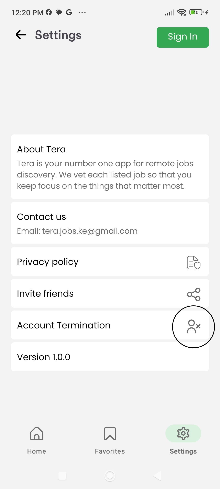

# How to delete your Flext user account

This is the procedure for user account deletion/termination.

## Step One

Open the app 

## Step Two

Click the settings icon

## Step Three

Select the account termination icon

## Step Four

Confirm account termination by clicking the Yes button 

## Help

Contact us via:

Email: Kodelite.ke@gmail.com

Mobile:+254 720 776 915/ +254 714 947 370